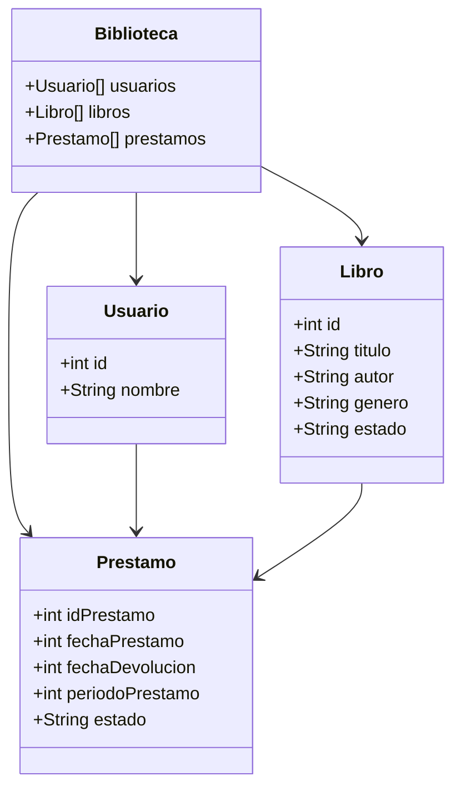

```mermaid
classDiagram
direction TB

class Libro {
+int id
+String titulo
+String autor
+String genero
+String estado
}

class Usuario {
+int id
+String nombre
}

class Prestamo {
+int idPrestamo
+int fechaPrestamo
+int fechaDevolucion
+int periodoPrestamo
+String estado
}

class Biblioteca {
+Usuario[] usuarios
+Libro[] libros
+Prestamo[] prestamos
}

Biblioteca --> Libro
Biblioteca --> Usuario
Biblioteca --> Prestamo
Usuario --> Prestamo
Libro --> Prestamo
```